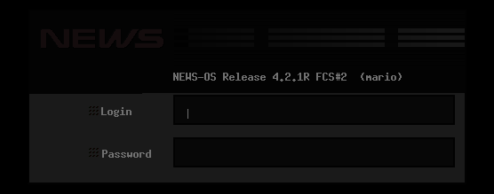
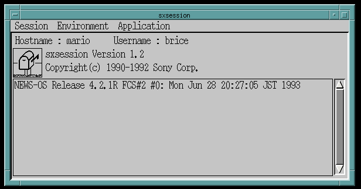
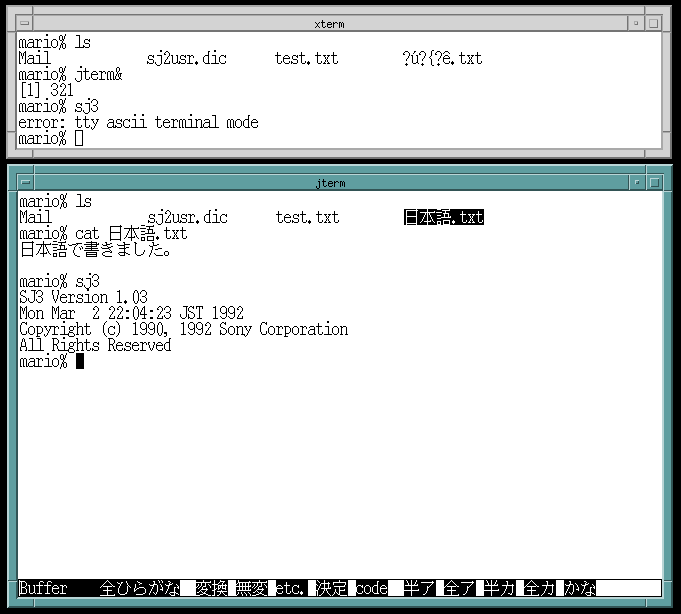

# NEWS-OS 4.2.1aR
NEWS-OS 4.2.1aR is the APbus RISC release of Sony's BSD-based OS. The CISC and
non-APbus RISC versions should be similar in operation.

## Installing NEWS-OS 4.2.1aR
On an APbus-based system, insert the CD-ROM (or flash the image to a SCSI2SD
or similar device), then boot into it from the NEWS ROM Monitor.

The bootloader will ask for information about the disk attached to SCSI ID 0 (it
can format the disk or use an existing disk label). Then, it will copy the
miniroot filesystem from the CD-ROM to the swap space on disk and boot from it.
Miniroot contains the installation script and programs. Once the miniroot image
has booted, the installation program will start automatically.

# X-Windows setup
When installing NEWS-OS 4.2.1aR, unless you have a fully working monitor, mouse,
and keyboard setup, I recommend installing the desired X11 packages but not
selecting the option to start X-Windows automatically at startup. This way, the
serial console will remain enabled in /etc/ttys. Then, `sxdm` or `xdm` can be
selected in `/etc/rc.custom` after the system install and will be started
automatically on subsequent boots.

### Selecting an X11 display manager
Sony included two X11 display managers with NEWS-OS 4.2.1, the standard `xdm` as
well as the Sony `sxdm` manager. The `sxdm` manager has a NEWS-specific login
screen, uses `mwm` as the default window manager, and has `sxsession` as the
login application. `xdm` uses `twm` as the default window manager, and has an `xterm`
session as the login application.

*sxdm login prompt*

*Sony SXsession launcher*

### Enabling Japanese text rendering
NEWS-OS has its own Japanese fonts. Modern installs of X11 don't include them.
To fix this, copy the contents of `/usr/lib/X11/fonts/sony` to a path on your
modern machine included on the X11 font path, like `~/.local/share/fonts`. You
can check what paths X11 has configured by running `xset q`.

Note that NEWS-OS will only work with Japanese text if the terminal is set to
use Japanese, which can be checked by using `set` to get the value of the `term`
variable. For example, `xterm` will only support ASCII, but `xterm-sjis` or `jterm` will
be able to display Shift-JIS encoded Japanese text. The `jterm` command will
launch `xterm` with `term` set to `jterm`.

### Japanese input
NEWS-OS has a few components that work together to enable Japanese input.
Additionally, terminal input is handled differently from X11. The components
have man pages in English and Japanese available, but in brief:
- `sj3serv`: Service that provides Kana to Kanji conversions
- `sj3`: Terminal that supports Japanese and English text input, and can
   communicate with `sj3serv` to provide Kana to Kanji capabilities as well.
   This includes file names. `sj3` will only work in a terminal that uses a
   Japanese encoding.

*ASCII vs SJIS terminal*

There are additional components (`sjx` for X11, `sj3dic` for managing custom
conversion dictionaries) as well as older utilities (`sj2`, `sj2dic`) that may
be available depending on what settings were selected during installation.
