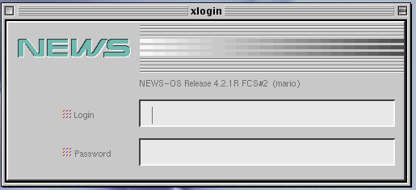

# NEWS-OS 4.2.1
NEWS-OS 4.2.1 is the last BSD-based version of NEWS-OS that Sony released. Starting with version 5, NEWS-OS was based on SVR4 instead.

NEWS-OS 4.2.1 comes in various flavors:
- 4.2.1C for the Motorola 68k-based NEWS workstations
- 4.2.1R for the MIPS R3000-based NEWS workstations
- 4.2.1RD for the MIPS R4000-based NWS-5000 series NEWS workstations (as mentioned on page 15 of the September 1993 issue of UNIX Magazine, ASCII Corporation).
- The patch kit I have refers to 4.2.1RN and 4.2.1RS as well, but I have not found what they are for yet.
- The final releases are 4.2.1a+R and 4.2.1a+C. This seems to be a minor revision of 4.2.1.

You can identify the version of 4.2.1 in use by looking at the end of the version string. For example, 4.2.1aR's version string is `NEWS-OS Release 4.2.1R FCS#2`. Patch kits that only work on 4.2.1a+ only allow `FCS#5` (for example, `0106.pch`). 4.2.1a+C also has the `FCS#5` version string.

Incidentally, if you have an upgrade kit for a+R/FCS#5, please let me know :)

## Installing NEWS-OS 4.2.1aRD
On an NWS-5000 or NWS-5900, insert the CD-ROM (or flash the image to a SCSI2SD
or similar device), then boot into it from the NEWS ROM Monitor.

```
> bo scsi(,60)
```

At least on the 5000X, the install script seems to choke if you supply the SCSI bus number (`0,60`) instead of just the ID. Why that is, I am not sure.
The bootloader will ask for information about the disk attached to SCSI ID 0 (it
can format the disk or use an existing disk label). Then, it will copy the
miniroot filesystem from the CD-ROM to the swap space on disk and boot from it.
Miniroot contains the installation script and programs. Once the miniroot image
has booted, the installation program will start automatically. Refer to `log/news-os-4-install.log` to see what this looks like in action.

## Enabling fastboot
By default, NEWS-OS 4.2 will run disk checks at every boot. While this is typically
a good idea, it can result in long boot times, especially if using a SCSI2SD or newer
hard drive formatted with more space than was realistic for the time. The `fastboot`
program bypasses the disk check for one boot by creating `/fastboot`, but `/etc/rc`
clears this by default, meaning that it doesn't persist, just does one reboot without
running disk checks. If you don't want to edit `/etc/rc` to bypass the check, you can
do it by creating `/fastboot` and making `/etc/rc.safs` with just an `exit 0` call.
This will cause `/etc/rc` to skip the removal of `/fastboot`, thus making every boot
skip the filesystem checks. If you do this, make sure you manually run fsck from time
to time, or after emergency power loss situations. This is a hack, so use with care :)

## Enabling extended boot logging
The monitor ROM will pass a 32-bit unsigned integer with boot flags that are OS-specific. NEWS-OS 4.2.1 has a few different flags, but the main flag of interest is 0x40000000. When this flag is provided to the bootloader, the kernel will print out additional information during the boot process.

For example, on an NWS-5000, you can set the flag variable with the `-o` parameter to `bo`.
```
> bo scsi(0,0) -o 40000000
```

## X-Windows setup
When installing NEWS-OS 4.2.1aR, unless you have a fully working monitor, mouse,
and keyboard setup, I recommend installing the desired X11 packages but not
selecting the option to start X-Windows automatically at startup. This way, the
serial console will remain enabled in /etc/ttys. The `dmset` command can be used
to enable it later (see below).

### Selecting an X11 display manager
Sony included two X11 display managers with NEWS-OS 4.2.1, the standard `xdm` as
well as the Sony NEWS Desk `sxdm` manager. The `sxdm` manager has a NEWS-specific login
screen, uses `mwm` as the default window manager, and has `sxsession` as the
login application. `xdm` uses `twm` as the default window manager, and has an `xterm`
session as the login application.


*sxdm login prompt*



*sxdm login prompt as rendered by MacX*


*Sony SXsession launcher*

To launch a display manager automatically at system boot time, run the `dmset` command.
`dmset` alone will set the default to `sxdm`, `dmset -x` will set it to `xdm`, and `dmset -n`
will disable X11 display manager auto-launch. `dmset` also edits `/etc/ttys` to disable
console login, so if you want to continue to have console login access, either revert `/etc/ttys`
after running `dmset`, or edit the line `DM=` in `/etc/rc.custom` to be `DM=sxdm` or `DM=xdm`
instead of running `dmset`.

### Enabling Japanese text rendering
NEWS-OS has its own Japanese fonts. Modern installs of X11 don't include them.
To fix this, copy the contents of `/usr/lib/X11/fonts/sony` to a path on your
modern machine included on the X11 font path, like `~/.local/share/fonts`. You
can check what paths X11 has configured by running `xset q`.

Note that NEWS-OS will only work with Japanese text if the terminal is set to
use Japanese, which can be checked by using `set` to get the value of the `term`
variable. For example, `xterm` will only support ASCII, but `xterm-sjis` or `jterm` will
be able to display Shift-JIS encoded Japanese text. The `jterm` command will
launch `xterm` with `term` set to `jterm`.

### Japanese input
NEWS-OS has a few components that work together to enable Japanese input.
Additionally, terminal input is handled differently from X11. The components
have man pages in English and Japanese available, but in brief:
- `sj3serv`: Service that provides Kana to Kanji conversions
- `sj3`: Terminal that supports Japanese and English text input, and can
   communicate with `sj3serv` to provide Kana to Kanji capabilities as well.
   This includes file names. `sj3` will only work in a terminal that uses a
   Japanese encoding.


*ASCII vs SJIS terminal*

There are additional components (`sjx` for X11, `sj3dic` for managing custom
conversion dictionaries) as well as older utilities (`sj2`, `sj2dic`) that may
be available depending on what settings were selected during installation.

## Rebuilding the NEWS-OS kernel
Like modern Unix and Linux systems, the kernel can be rebuilt with configuration changes.
```csh
# Switch to kernel configuration directory
% cd /sys/conf
# Edit the desired parameters in /sys/conf/NEWS5000
# Execute the required config and make commands
% config NEWS5000
% cd ../NEWS5000
% make depend
% make
```
After running make, the new kernel, `vmunix`, will be available and can be loaded from the ROM monitor, or placed at
`/vmunix`. After reboot, the kernel build date should match when `make` was run (per NEWS system clock).

## NEWS-OS 4 RTC Patch Kit
NEWS-OS 4 patches are included with the NEWS-OS 6 patch kit. The patches used to be available from Sony's FTP server, but it was sadly shut down in the mid-2000s. However, Sony did release a CD with the NEWS-OS 4 and 6 patches.


To apply patches, copy the patch kits to the hard drive and reboot to single-user mode. Then, you can install each patch by running the corresponding `.pch` shell script. Each patch includes a description, not all patches are needed for every system (and some patches only apply to R or C, not both).
Patches must be installed in order, lower number to higher number. While the patches are listed as being for 4.2.1a+, many patches will work with older revisions of 4.2 as well. Each patch script will do its own version check, so you can read it to see if your NEWS-OS version will pass the version check or not.
