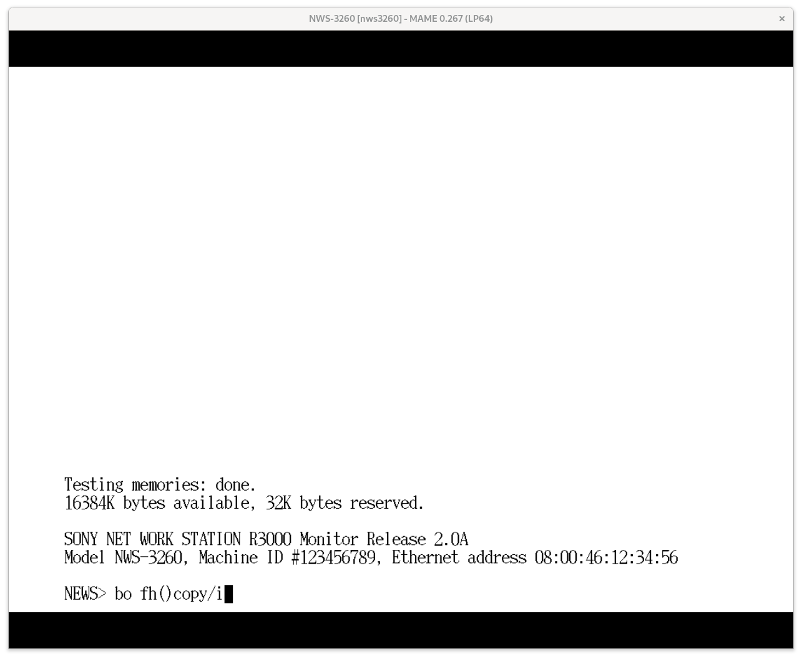
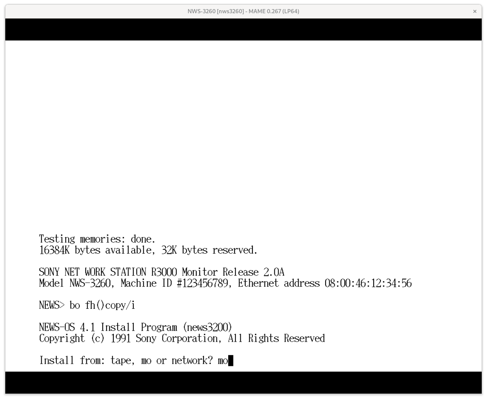
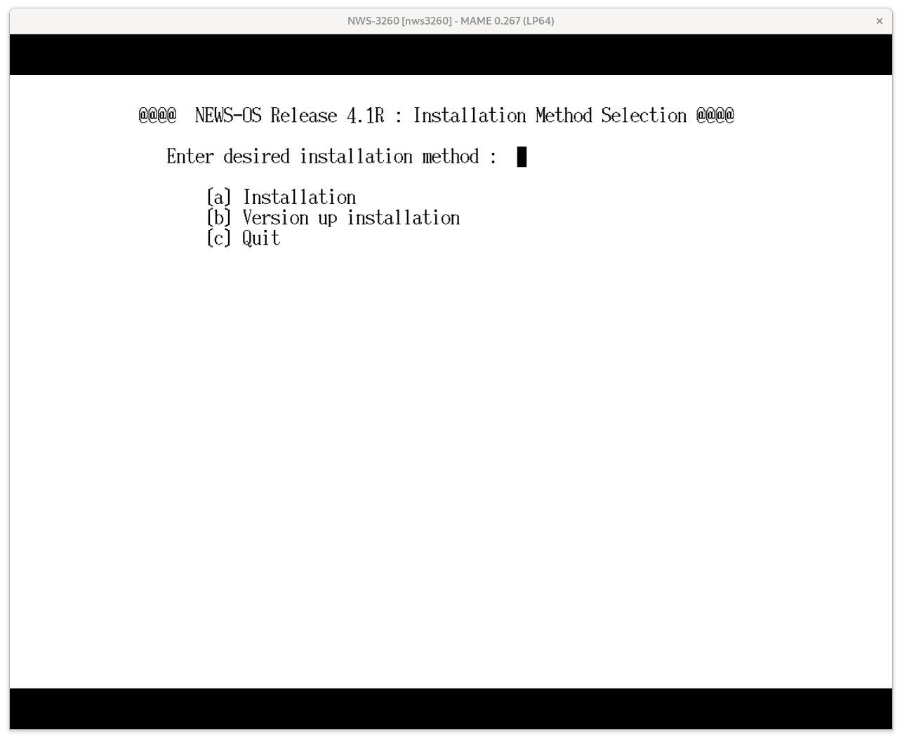
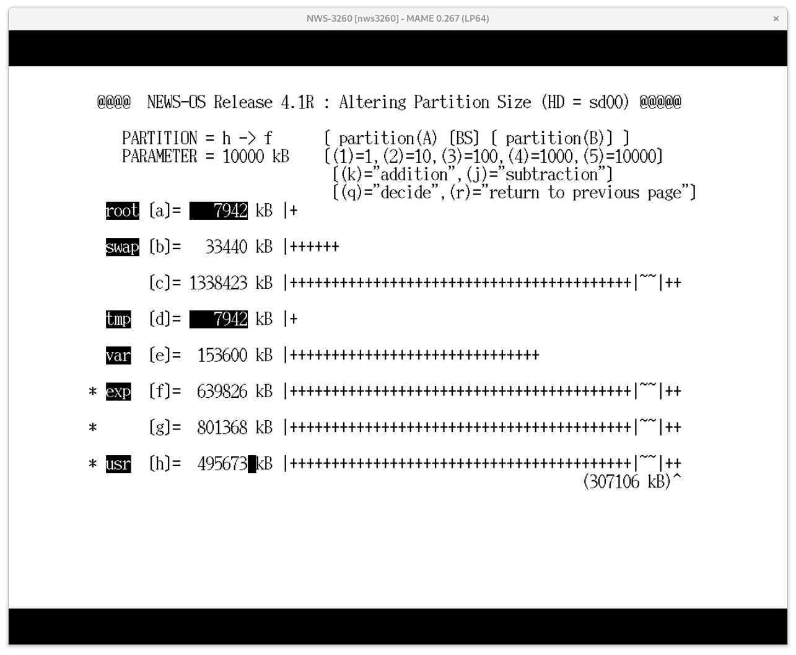
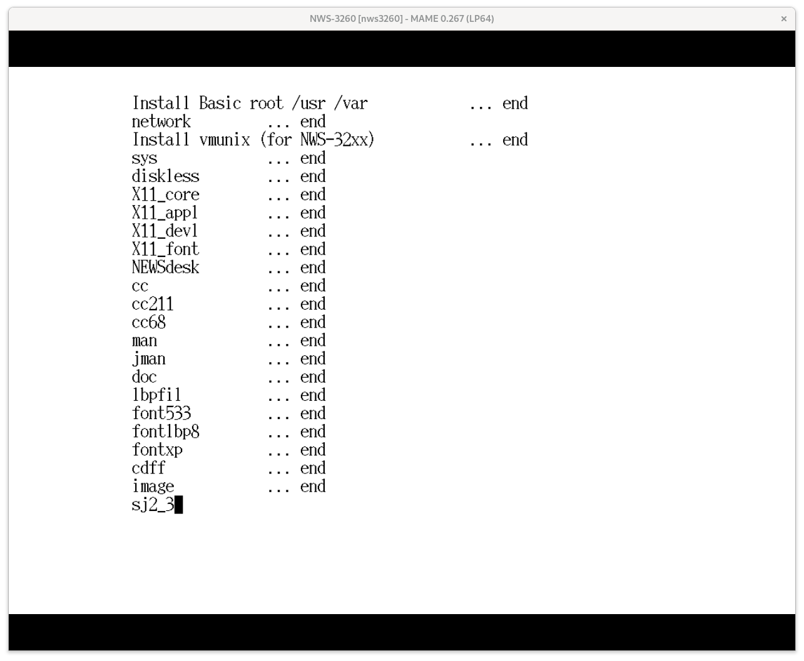
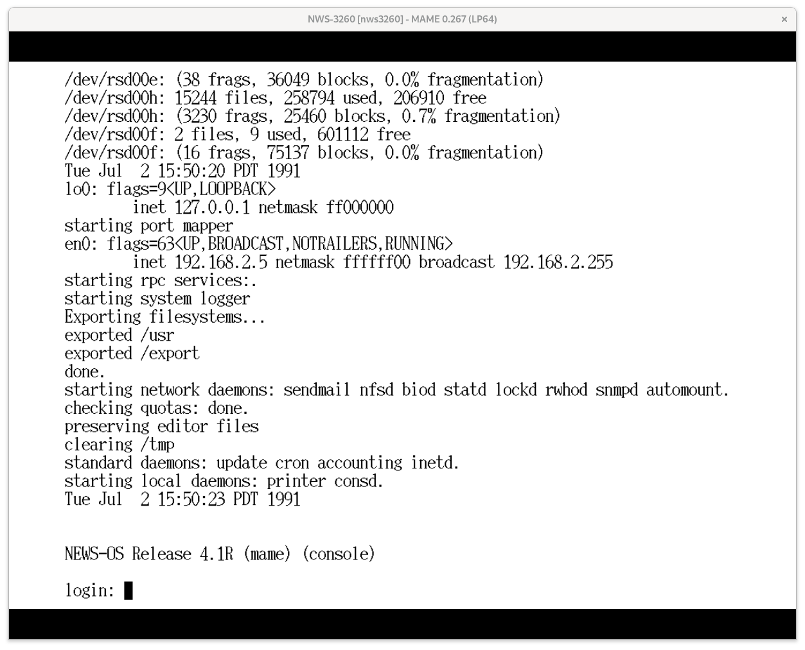
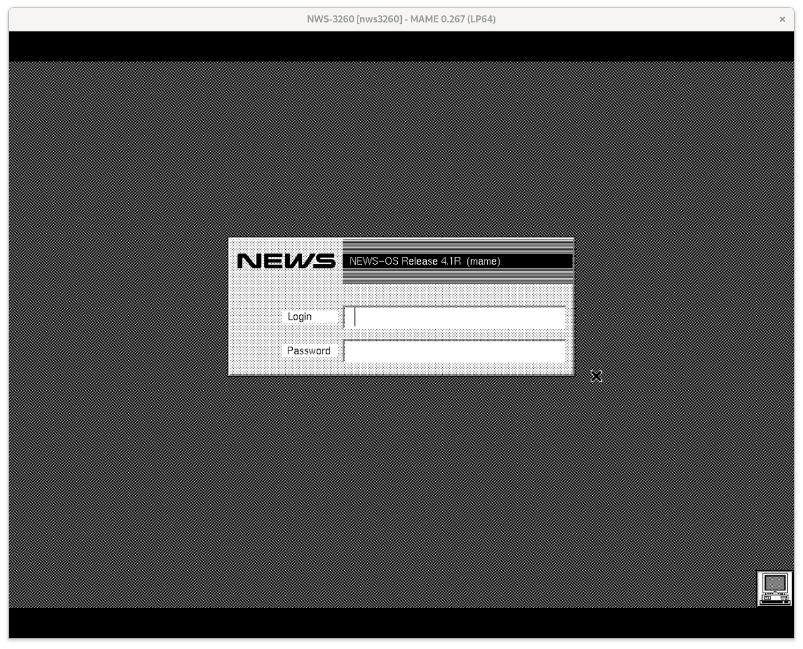

# Setting up an emulated NWS-3260

The NWS-3260 is a MIPS R3000-based workstation laptop. Installation media is avaliable for the BSD-based NEWS-OS 4.1R, and this guide is a step-by-step guide for installing it.

## Installing NEWS-OS 4.1R

### Requirements

- MAME version 0.267 or later (IMPORTANT: versions before 0.267 had the nws3260 driver but it was not compatible with NEWS-OS 4.1R)
- NWS-3260 firmware image and 4.1R floppy and magneto-optical disk images (see the MAME software list for the expected names and hashes)
- If you are dumping your own 4.1R magneto-optical disk, you must convert it to CHD format and add the IDNT metadata tag as "SONY    SMO-C501        1.00" so that it is properly recognized as an MO disk, rather than a hard disk. The NEWS-OS installer checks the IDNT information to distinguish between HD and MO devices.

### Booting to the NEWS ROM monitor

- Put firmware images in `roms/nws3260` and the software list items into `roms/sony_news/nwf_672rb`
- Download and extract the `hd1307.img` pre-formatted blank hard drive image from [this repository](src/news-inst/blank-images/hd1307.img.gz). The format program is not yet supported by the driver. If you want a disk of a different size, you can use the NWS-5000X driver to format a blank file. The NEWS-OS 4.2.1 installer program for the 5000X is a bit better at not choking on arbitrarily-sized hard drives. See [nws5000x-mame.md] for details. 1307 MBytes is enough for a full NEWS-OS 4.1R installation if you adjust the size of the `/usr` partition, so for most users, I would recommend sticking with the `hd1307` image.
- If you want to connect to the 3260 via the network, be sure to use taputil to set up your network TAP/TUN device before launching MAME. The NWS-3260 is a monochrome machine, so if you want to use X in color, you will need to connect over the network using XDMCP.
After starting MAME, make sure to select `TAP/TUN device` in the `Network Devices` menu.
- Launch MAME with the following command line:

```sh
sudo src/osd/sdl/taputil.sh -c $USER 192.168.5.5 192.168.5.99 # only if planning on using networking
mame nws3260 -scsi:4 harddisk -hard1 hd1307.img -hard2 nwf_672rb -flop nwf_672rb
```

If all goes well, you should see the NEWS R3000 monitor prompt (`NEWS>`). The extra `harddisk` virtual device is needed to emulate a magneto-optical drive. The NWF-672RB install kit for NEWS-OS has a floppy disk for booting the installer, but loads all of the data from the included MO disk.

### Installing NEWS-OS 4.1R

- Boot from the floppy drive by running `bo fh()copy/i`


- Delete `tape` and input `mo`, then press enter.

- Press enter on the prompt for the MO's SCSI ID to accept the default, ID 4
- Press enter on the prompt for the destination to accept the default, `hd`, and again to accept the default HD SCSI ID, 0.
- Because the image has already been formatted, respond with a `y` to the prompt `Tahoe disklabel is already set, use this (y/n)?`
- The installer bootstrap program will copy the miniroot Unix kernel from the MO disk and  boot into it. The installer program will launch automatically after the miniroot kernel loads.

- Press `a` and then `y` to begin the installation process
- Press `c` and then `y` to select `MO disk` as the installation kit type
- Press `y` again to accept the MO drive as `sd04`
- Select a language and a timezone
- Press `y` to continue with installing to the `hd1307` disk image, and press `y` two more times to mount `/usr` locally and use the default installation partitions.
- Select the packages you want to install, or press `*` to select everything. This will put you over the limit, but you can adjust the partition size on the next screen. Press enter to continue.
- Press `n` to change the partition size. I recommend shrinking the `exp` partition (partition f), since you most likely want to play around with NEWS-OS utilities rather than host an NFS server or something else that needs a huge `exp` partition. Select `h->f` then use the `1`-`5` and `k` keys to grow the `usr` partition to be bigger than the install size, then press `q` then `y` to continue.

- If you want to connect to a network, select `y` and enter the IP address you intend the emulated platform to use.
- If you always want the system to boot straight into X, select `y` on the next screen. Otherwise, press `no` to boot into console instead. You can later launch `sxdm` from the terminal to bring up the GUI.

After this, the installer will adjust the partition sizes and install the selected packages. This will take a while. Once it is complete, hard restart MAME. The driver has some issues when the kernel is rebooted.


### Booting NEWS-OS 4.1R for the first time

- You no longer need to add an extra drive to the SCSI chain or use the floppy image.
- Boot from the hard disk by running `bo`
- If all goes well, this will boot to the login prompt. This may take a very long time due to the disk check. See `news-os-42.md` for instructions on bypassing the disk check for future boots.

- Run `sxdm` if you want to use the GUI.

- You should be able to log in (`root`, no password by default) and use the emulated platform! You can use `sxadmin` to add additional users from the GUI, or use the usual BSD user management commands from the terminal.
- Setting up networking can be a bit tricky. Make sure that you have selected "TAP/TUN device" in the MAME UI (Press
Scroll Lock to disable special key passthrough, then press Tab, then scroll down to `Network Devices`).
Then, you should be able to reach the emulator at the configured IP address, as long as you used TAP.
Make sure you add your host as the default route, otherwise XDMCP (and some other applications)
may not work: `route add default <TAP/TUN host IP> 1`
- If you wish to use the GUI (NEWS Desk on Motif/`mwm`) and didn't select it as the default during the install process, run the command `sxdm` as root. Once `sxdm` is running, you can also log in over the network assuming you set the default route as listed above.
You can use Xephyr or Xnest to do so (8-bit color mode with Xephyr recommended).
See [xdmcp.py](https://github.com/briceonk/news-os/blob/master/src/xdmcp.py) for a wrapper script
(or to get the command details for Xephyr)
- To shutdown the system cleanly, run `shutdown -x now` as `root`. Once the monitor ROM has printed `Good bye!`, you can quit MAME.
