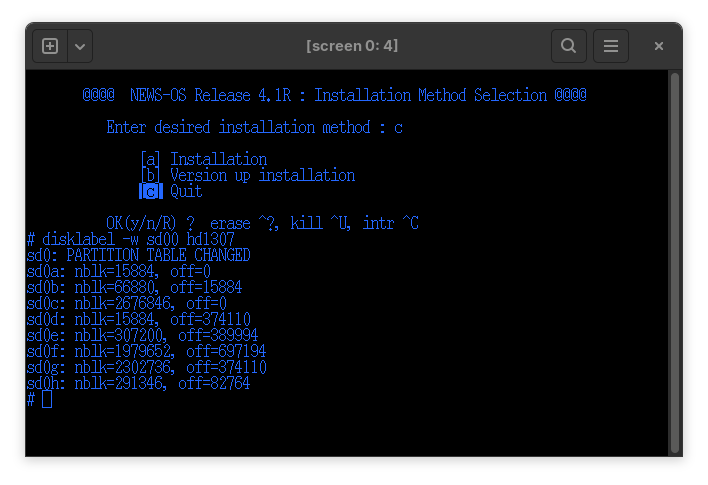

# Setting up an emulated NWS-3860

The NWS-3860 is a dual-CPU Unix workstation with a MIPS R3000 main CPU and a Motorola 68030 I/O processor.
Installation media is available for the BSD-based NEWS-OS 4.1R, and this is a step-by-step guide for installing it.
Please note that while this guide explains the basics of configuring MAME, there is much more than I can cover here.
See the [MAME documentation](https://docs.mamedev.org/) for more information.

## Installing NEWS-OS 4.1R

### Requirements

- MAME version 0.281 or later (IMPORTANT: versions before 0.281 had the nws3860 driver, but it was a skeleton)
- NWS-3860 firmware image and 4.1R floppy and magneto-optical disk images (see the MAME software list for the expected
  names and hashes)
- If you are dumping your own 4.1R magneto-optical disk, you must convert it to CHD format and add the `IDNT` metadata
  tag as `SONY SMO-C501 1.00` so that it is properly recognized as an MO disk, rather than a hard disk. The
  NEWS-OS installer checks the SCSI inquiry information to distinguish between HD and MO devices.

### Creating a disk image

To create a disk image, you will need to determine what size you want and find the closest match in `/etc/disktab` in
NEWS-OS. Once you have that, you can get the `IDNT` data by looking at the table in the format disk (search the binary
file for the disklabel you want).

If you just want to get running with a disk image that has tons of room for most anything you'd want to do, use this:

```sh
chdman createhd -chs 2099,17,76 -c none -o hd1307.chd
chdman addmeta -i hd1307.chd -t IDNT -vt "SEAGATE ST41520N        1.00"
```

`chdman` is a program included with MAME for managing disk images.

### Booting to the NEWS ROM monitor

- Put firmware images in `roms/nws3860` and the software list items into `roms/sony_news/nwf_672rb`
- Use the image created in the previous step as the hard disk
- If you want to connect to the 3860 via the network, be sure to use `taputil` to set up your network TAP/TUN device
  before launching MAME. Windows and macOS instructions may differ for network setup, so please check the MAME
  documentation for the full details. I included the Linux setup since that is what I typically use for development.
- The extra `harddisk` virtual device is needed to emulate a magneto-optical drive. The NWF-672RB install kit for
  NEWS-OS has a floppy disk for booting the installer, but loads all the data from the included MO disk.
- The format disk doesn't seem to write the disklabel to the system, so these steps do that manually and skip the format
  disk. I'm not sure if this is an emulation gap or a procedure issue. If you have a NEWS-OS 4.1R installation manual,
  please let me know!

Example commands:

```sh
sudo src/osd/sdl/taputil.sh -c $USER 192.168.5.5 192.168.5.1 # assumes you are running from the MAME source code directory; replace with your network setup command or omit if desired
mame nws3860 -scsi0:4 harddisk -hard1 hd1307.chd -hard2 nwf_672rb -flop nwf_672rb -serial0 pty # `-serial0 pty` may not work for Windows, but it does work for Linux and macOS
```

If you use `pty` for the serial connection, bring up the MAME UI (Scroll Lock on Linux/Windows, Forward Delete on macOS)
and navigate to the `Pseudo Terminals` option. This will point to the `pty` to connect to with `screen`, `minicom`, etc.
Once connected, press enter. You should see the NEWS monitor prompt `NEWS>` (there are additional messages, but you have
to be quick to see those when using `pty`).

If you are using the default terminal, make sure that you disable the `NEWS Keyboard and Mouse` and enable the
`Generic Keyboard` in the MAME settings (`Input Settings -> Keyboard Selection`) so you can interact with the ROM
monitor and NEWS-OS over serial.

### Installing NEWS-OS 4.1R

- Boot from the floppy drive by running `bo fh()copy/i`
- Delete `tape` and input `mo`, then press enter.
    - 
- Press enter on the prompt for the MO's SCSI ID to accept the default, ID 4
- Press enter on the prompt for the destination to accept the default, `hd`, and again to accept the default SCSI ID, 0.
- Select the desired root partition size. This will be overwritten shortly, so you can pick any of them (`s`/`m`/`l`)
    - 
- The installer bootstrap program will copy the miniroot Unix kernel from the MO disk and boot into it. The installer
  program will launch automatically after the miniroot kernel loads.
    - 
- Press `c` then `y` and wait a little bit for the installation program to exit.
    - 
- Execute the command `disklabel -w sd00 hd1307` to write the disklabel. The installer will automatically format each
  partition later. If you used a disk size/partition table other than `hd1307`, use that for the disklabel instead.
    - 
- Then, run `./Install` to re-launch the installer.
    - Note: I've seen this have some issues before, but it isn't consistent. If the installer doesn't load, simply
      reboot MAME and start following the below steps once the installer starts (following the same boot steps). The
      disklabel will persist as long as you answer `y` when the installer program asks if it should use the existing
      disklabel.
- Press `a` and then `y` to begin the installation process
- Press `c` and then `y` to select `MO disk` as the installation kit type
- Press `y` again to accept the MO drive as `sd04`
- Select VT-100 (`k`) as the terminal type
- Select a language and a timezone
- Press `y` to continue with installing to the `hd1307` disk image, and press `y` two more times to mount `/usr` locally
  and use the default installation partitions (optionally, you can swap the `usr` and `exp` partitions here, but you can
  also resize them later).
- Select the packages you want to install, or press `*` to select everything. This will put you over the limit, but you
  can adjust the partition size on the next screen. Press enter to continue.
- Press `n` to change the partition size. I recommend shrinking the `exp` partition (partition f), since you most likely
  want to play around with NEWS-OS utilities rather than host an NFS server or something else that needs a huge `exp`
  partition. Select `h->f` then use the `1`-`5` and `k` keys to grow the `usr` partition to be bigger than the installed
  size, then press `q` then `y` to continue. The required partition size is in the lower-right corner.
    - 
- If you want to connect to a network, select `y` and enter the IP address you intend the emulated platform to use. If
  you want to use X11, make sure you answer `y` here, since there is no framebuffer emulation yet.
- Select `n` on the next screen related to X11. You can later launch `sxdm` from the terminal to allow network logins to
  use X11.

After this, the installer will commit the final partition sizes, format each partition, and install the selected
packages.


This will take a while. Once it is complete, it will halt and return to the monitor ROM prompt (`NEWS>`). From here,
shut down the emulated platform by running the `off` command. The driver has some issues when the kernel is rebooted, so
you don't want to immediately try to boot NEWS-OS.

### Booting NEWS-OS 4.1R for the first time

- You no longer need to add an extra drive to the SCSI chain for the MO drive or use the floppy image, so you can remove
  `-scsi0:4 harddisk`, `-hard2 nwf_672rb`, and `-flop nwf_672rb` from your command line arguments to MAME. Most CLI
  programs in NEWS-OS don't use special control characters as much as the installer does, so you can also remove
  `-serial0 pty` if you wish. Ensure you enable the terminal's "Generic Keyboard" (see steps above) if you do.
- Once the emulated platform boots to the NEWS monitor ROM, boot from the internal hard disk by running `bo`.
    - 
- If all goes well, this will boot to the login prompt. This may take a very long time due to the disk check. See
  `news-os-42.md` for instructions on bypassing the disk check for future boots.
    - 
- Log in as `root`. There is no password by default.
- To shut down the system cleanly, run `shutdown -x now` as `root`. The emulated system will power off and quit MAME
  automatically when it is done synchronizing the disks.

### Enabling Networking

Setting up networking can be a bit tricky. The below instructions are for Linux. Please check the MAME documentation for
other operating systems.

- First, make sure that you have selected "TAP/TUN device" in the MAME UI.
    - Press Scroll Lock to disable special key passthrough, then press Tab, then scroll down to `Network Devices`).
- Then, you should be able to reach the emulator at the configured IP address, as long as you used `taputil.sh` per the
  instructions earlier in this document.
- Make sure you add your host as the default route, otherwise XDMCP (and some other applications) may not work.
    - `route add default <TAP/TUN host IP> 1`

### Enabling X11

- On the NWS-3860, `sxdm` (the NEWS Desk display manager) does not like having a framebuffer session by default. So, do
  the following as `root` before starting `sxdm`:
    ```sh
    vi /etc/sxdm/Xservers
    # Use the arrow keys to move the cursor to the last line, ":0 local /usr/bin/X11/X -ls 3000 -bs
    # Press the 'd' key twice to delete it, then press Esc, then ":wq" to save the file to disk
    ```
- Next, run the `sxdm` command as `root`. This will start `sxdm` and you may connect to it over the network using Xephyr
  or Xnest (8-bit color mode with Xephyr recommended.)
  See [xdmcp.py](https://github.com/briceonk/news-os/blob/master/src/xdmcp.py) for a wrapper script (or to get the
  command details for Xephyr)
    - 
    - Example Xephyr command:
      ```sh 
      Xephyr -query <MAME target IP address> -screen 1280x1024x8 -fp catalogue:/etc/X11/fontpath.d,built-ins,/home/<user>/.local/share/fonts +byteswappedclients :2
      ```
    - You can also use `xdm` instead of `sxdm`, but `sxdm` has a cool NEWS-specific login screen and automatically
      launches `sxsession` when you log in.
    - You will need to copy the NEWS-OS fonts from the subfolders of the NEWS `/usr/lib/X11/fonts` directory to your
      `~/.local/share/fonts` directory. You can use `ftp` for this (among many other ways).
- Once you have logged in to X11, you can use the `sxadmin` program to add a non-root user. Of course, you can also use
  traditional Unix CLI tools to do so :)
