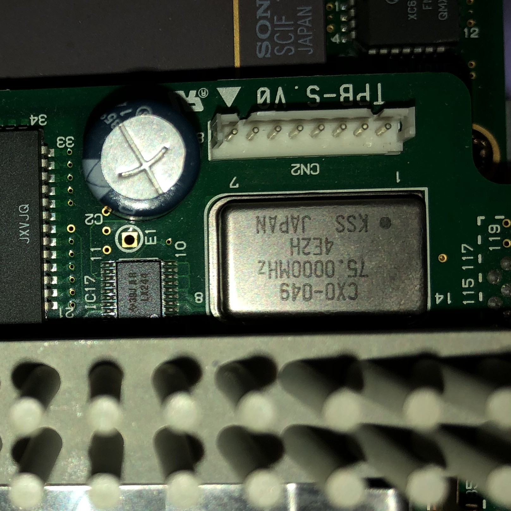

# NWS-5000X Board Pictures
NWS-5000X opened up

MIPS R4400SC CPU card. CPU is under the heat sink, and is surrounded by the secondary cache chips, Motorola MCM67A618FN12 memory ICs

Closeup of the 75MHz crystal on the CPU card

Images of the MPU-33 motherboard

IO board

IO board closeup showing the DMAC3Q (DMA controller), WSC-PARK3 (gate array?), system ROM, and ST Micro Timekeeper RAM.

2x Hewlett Packard 1TV3-0302 SPIFI3 SCSI controllers

Sony CXD8409Q Parallel I/O Interface

National Semi DP83932BVF SONIC Ethernet Controller

2x WSC-FIFOQ FIFO chips, WSC-SONIC3 Ethernet AP-Bus interface, National Semi PC8477BV-1 Floppy Controller, WSC-ESCC1 serial AP-Bus interface, Zilog Z8523010VSC ESCC serial interface

DSC-39 xb framebuffer card

