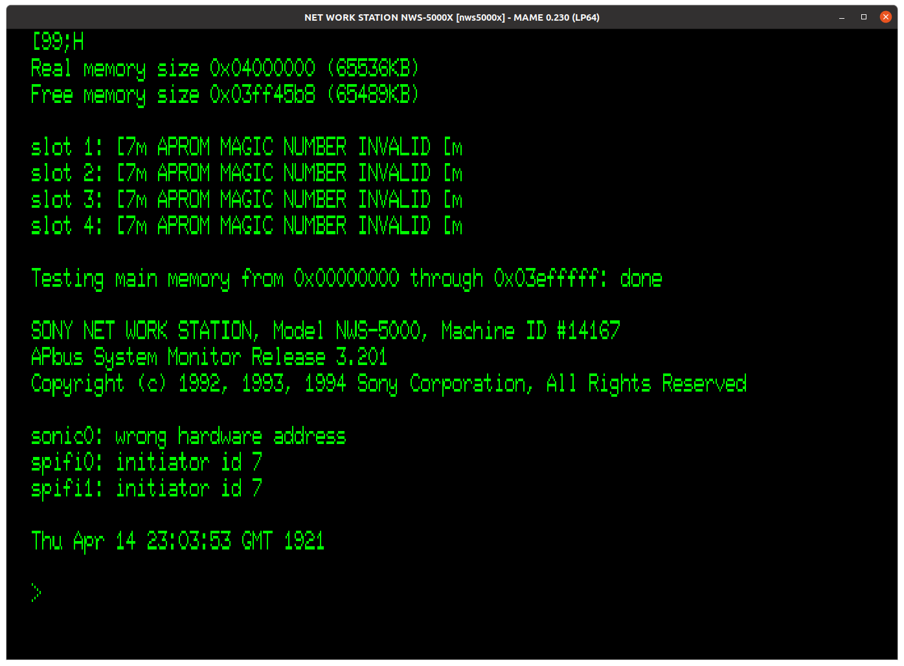
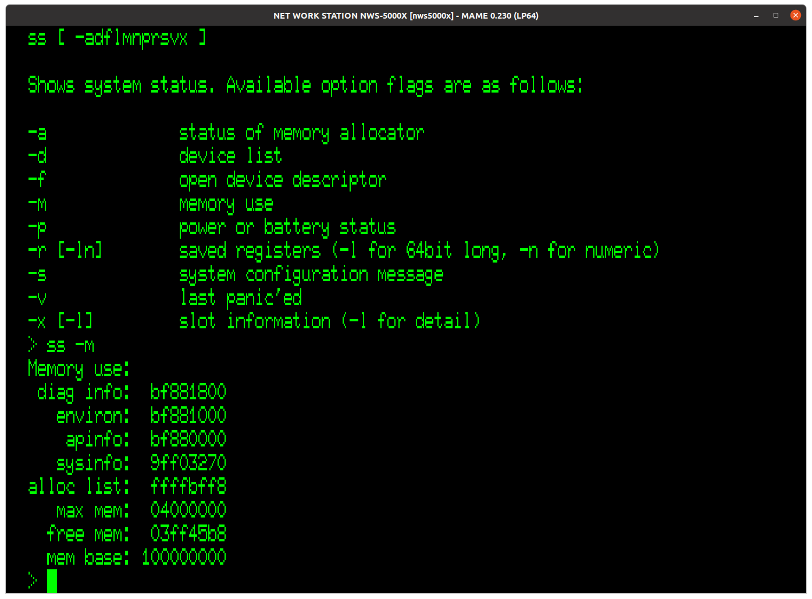
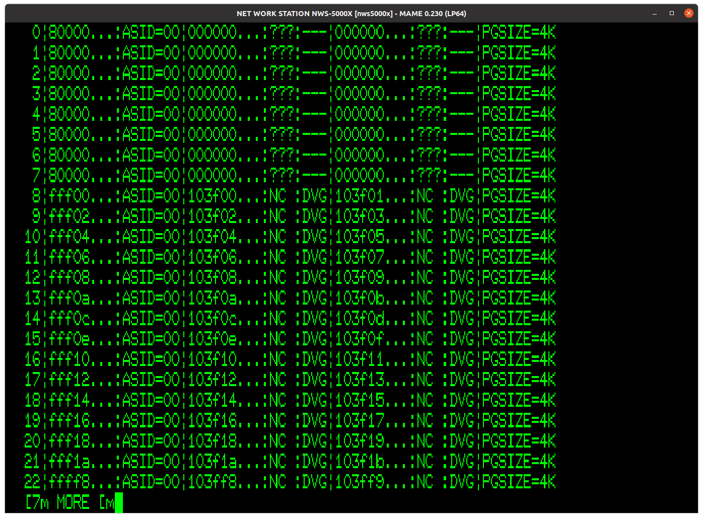
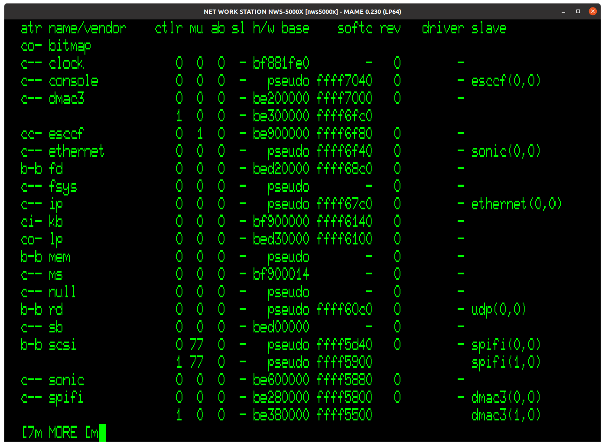

# MAME emulation notes
The NWS-5000X driver can be found in [this MAME fork](https://github.com/briceonk/mame). While there are a few new files, the main driver file can be found [here](https://github.com/briceonk/mame/blob/master/src/mame/drivers/news_r4k.cpp).

## Current status
With a few hacks, the driver can boot the monitor ROM. Basic commands (memory viewing, status information, expression evaluation, etc.) are mostly functional, anything requiring non-serial I/O is not.  See the driver comments for a more exhaustive list of what is/isn't emulated.

*MAME booted to the monitor ROM prompt*

*Emulated NWS-5000X's memory status from `ss -m`*

*TLB information dumped using the hidden `mp` command*

*Device list. Note that a few tricks are used to get it to think the DMAC and SPIFIs are visible even though they are not emulated. The SONIC shows up regardless of if it is actually functional or not.*

## Issues
Not counting things that aren't emulated, there are a few major issues I haven't been able to solve yet.

1. Physical memory mapping and general physical address issues
- It took me a very long time to find a configuration that allowed the monitor ROM to enumerate 64MB of RAM (matches what my platform has). Using a disassembler, I was able to partially reverse engineer the algorithm it uses to scan memory and I came up with a hack that hooks off of a change in a part of memory to shift the memory addresses around to stop the monitor ROM from getting lost in the weeds. This change might be a coincidence, but it happens in between the first scan (where it expects the memory to be split) and the second scan (where it expects the unified 64MB starting from 0x0).
- Because of this, I'm not sure if I am missing something in how the memory scan is supposed to work, or if one of the ASICs on the board is actually playing around with the address map to compensate for how the board and/or memory cards are physically designed.
- Note that the MIPS R4400SC has a 36-bit physical address bus. I'm not sure if this is breaking things either. I haven't found a way to have an offset greater 32 bits in MAME yet, but that might help. The MSB of the physical address (bit 33) seems to be influenced by the memory region used to access it. See the below section for more details. The memory base from the status command `ss -m` (see above screenshot) has the RAM base set to 0x100000000.
2. AP-Bus emulation
- Documentation is completely lacking for the AP-Bus and its associated chips. For now, I've hacked it so the monitor ROM can boot, but there is a lot that will need to be figured out on the fly as more devices are emulated.

## Using a modified ROM image in MAME
The monitor ROM does a basic checksum of itself before booting. You can patch this out by changing the code at offset 0x70C to:
```assembly
bne $0, $0, $bfc009c4  ; 0x140000AD in hex
```
The monitor ROM will still run the checksum, but when it fails it will not branch to the boot halt address (0xbfc009c4, which just branches to itself).

## 5000X memory handling
I ran some experiments on my 5000X to see how the monitor ROM would react to the various access types. The MIPS R4400 has 4 memory regions that map to physical addresses in various ways:
- kuseg (0x0-0x7fffffff): Access to these addresses is allowed in all modes, including user mode. Additionally, the accesses go through the MMU for translation from virtual to physical addresses, which uses the TLB set up by the system kernel (in this case, the monitor ROM).
- kseg0 (0x80000000-0x9fffffff): Kernel mode only. Maps directly to physical addresses, but does go through the cache. The MSB is stripped to produce the physical address, so this can only access the first 512MB of the physical memory map.
- kseg1 (0xa0000000-0xbfffffff): Same thing as kseg0 but bypasses the cache and goes directly to the physical I/O. Retains the 512MB restriction.
- kseg2 (0xc0000000-0xffffffff): Supervisor and kernel modes only, but goes through the cache and MMU like kuseg. When running in supervisor mode, only the lower 500MB of this region is mapped, to provide the kernel or hypervisor with additional mapping space that it can use without changing the supervisor's map. The monitor ROM runs in supervisor mode, so it can access all of these regions without causing an address error. The R4400 documentation refers to these two regions as ksseg (supervisor space) and kseg3 (kernel space 3) respectively. Other documents refer to the whole block as kseg2.

Now, the fun part. Writing random garbage into memory!

These are the tools we need for this:
- `md`: Displays memory contents
- `me`: Interactively edit memory contents
- `mp`: Hidden command (meaning it doesn't show up when running `he`, but running `he mp` will trigger the help text for it) to dump the contents of the TLB. The command `ss -r`, which dumps the processor registers, also dumps out the TLB, but this appears to be broken on this ROM revision - the values are total garbage.

First, let's take a look at what the TLB actually looks like. Usually I will only show the relevant parts, but to start off with, here is the full thing:
```
> mp
 0|80000...:ASID=00|000000...:???:---|000000...:???:---|PGSIZE=4K
 1|80000...:ASID=00|000000...:???:---|000000...:???:---|PGSIZE=4K
 2|80000...:ASID=00|000000...:???:---|000000...:???:---|PGSIZE=4K
 3|80000...:ASID=00|000000...:???:---|000000...:???:---|PGSIZE=4K
 4|80000...:ASID=00|000000...:???:---|000000...:???:---|PGSIZE=4K
 5|80000...:ASID=00|000000...:???:---|000000...:???:---|PGSIZE=4K
 6|80000...:ASID=00|000000...:???:---|000000...:???:---|PGSIZE=4K
 7|80000...:ASID=00|000000...:???:---|000000...:???:---|PGSIZE=4K
 8|ffff8...:ASID=00|103ff8...:NC :DVG|103ff9...:NC :DVG|PGSIZE=4K
 9|fff02...:ASID=00|103f02...:NC :DVG|103f03...:NC :DVG|PGSIZE=4K
10|fff04...:ASID=00|103f04...:NC :DVG|103f05...:NC :DVG|PGSIZE=4K
11|04000...:ASID=00|004000...:UC :DVG|004001...:UC :DVG|PGSIZE=4K
12|fff08...:ASID=00|103f08...:NC :DVG|103f09...:NC :DVG|PGSIZE=4K
13|fff0a...:ASID=00|103f0a...:NC :DVG|103f0b...:NC :DVG|PGSIZE=4K
14|fff0c...:ASID=00|103f0c...:NC :DVG|103f0d...:NC :DVG|PGSIZE=4K
15|14910...:ASID=00|014910...:UC :DVG|014911...:UC :DVG|PGSIZE=4K
16|fff10...:ASID=00|103f10...:NC :DVG|103f11...:NC :DVG|PGSIZE=4K
17|fff12...:ASID=00|103f12...:NC :DVG|103f13...:NC :DVG|PGSIZE=4K
18|fff14...:ASID=00|103f14...:NC :DVG|103f15...:NC :DVG|PGSIZE=4K
19|03f4e...:ASID=00|003f4e...:UC :DVG|003f4f...:UC :DVG|PGSIZE=4K
20|149f0...:ASID=00|0149f0...:UC :DVG|0149f1...:UC :DVG|PGSIZE=4K
21|ffffa...:ASID=00|103ffa...:NC :DVG|103ffb...:NC :DVG|PGSIZE=4K
22|03ffe...:ASID=00|003ffe...:UC :DVG|003fff...:UC :DVG|PGSIZE=4K
23|fff1e...:ASID=00|103f1e...:NC :DVG|103f1f...:NC :DVG|PGSIZE=4K
24|fff20...:ASID=00|103f20...:NC :DVG|103f21...:NC :DVG|PGSIZE=4K
25|149a0...:ASID=00|0149a0...:UC :DVG|0149a1...:UC :DVG|PGSIZE=4K
26|14950...:ASID=00|014950...:UC :DVG|014951...:UC :DVG|PGSIZE=4K
27|fff26...:ASID=00|103f26...:NC :DVG|103f27...:NC :DVG|PGSIZE=4K
28|fff28...:ASID=00|103f28...:NC :DVG|103f29...:NC :DVG|PGSIZE=4K
29|fff2a...:ASID=00|103f2a...:NC :DVG|103f2b...:NC :DVG|PGSIZE=4K
30|ffff4...:ASID=00|103ff4...:NC :DVG|103ff5...:NC :DVG|PGSIZE=4K
31|fff2e...:ASID=00|103f2e...:NC :DVG|103f2f...:NC :DVG|PGSIZE=4K
32|fff30...:ASID=00|103f30...:NC :DVG|103f31...:NC :DVG|PGSIZE=4K
33|14970...:ASID=00|014970...:UC :DVG|014971...:UC :DVG|PGSIZE=4K
34|14980...:ASID=00|014980...:UC :DVG|014981...:UC :DVG|PGSIZE=4K
35|14940...:ASID=00|014940...:UC :DVG|014941...:UC :DVG|PGSIZE=4K
36|14920...:ASID=00|014920...:UC :DVG|014921...:UC :DVG|PGSIZE=4K
37|14900...:ASID=00|014900...:UC :DVG|014901...:UC :DVG|PGSIZE=4K
38|14990...:ASID=00|014990...:UC :DVG|014991...:UC :DVG|PGSIZE=4K
39|fff3e...:ASID=00|103f3e...:NC :DVG|103f3f...:NC :DVG|PGSIZE=4K
40|14930...:ASID=00|014930...:UC :DVG|014931...:UC :DVG|PGSIZE=4K
41|fff42...:ASID=00|103f42...:NC :DVG|103f43...:NC :DVG|PGSIZE=4K
42|0fff4...:ASID=00|00fff4...:UC :DVG|00fff5...:UC :DVG|PGSIZE=4K
43|14960...:ASID=00|014960...:UC :DVG|014961...:UC :DVG|PGSIZE=4K
44|ffff6...:ASID=00|103ff6...:NC :DVG|103ff7...:NC :DVG|PGSIZE=4K
45|fff4a...:ASID=00|103f4a...:NC :DVG|103f4b...:NC :DVG|PGSIZE=4K
46|fff4c...:ASID=00|103f4c...:NC :DVG|103f4d...:NC :DVG|PGSIZE=4K
47|fff4e...:ASID=00|103f4e...:NC :DVG|103f4f...:NC :DVG|PGSIZE=4K
```
Right away, there are some interesting things going on. Note that this was captured after I was poking at some memory regions, after a clean boot the TLB usually has only 0xfff... entries mapped.
- The first 8 entries are skipped by the monitor ROM initialization. These are most likely reserved for the OS.
- The physical addresses for the 0xfff... addresses have the 33rd bit set - beyond the 32 bit virtual address limit (totally valid on the R4400).
- Some of the other regions I was playing around with do NOT have this bit set. This will be important later. Note that the monitor ROM is responsible for filling the TLB in this case. The MIPS architecture requires memory management to be done by the kernel. When a TLB miss occurs, the OS has to look up the page table entry to map. Since we have no OS running, the monitor ROM does the memory mapping. It has a very simple mapping algorithm - accesses to the user space will be directly passed through to the physical address. It also maps the upper portion of kseg3 to the last portion of the physical memory (reserved for the monitor ROM, even the OS won't touch it - see the NetBSD source code).

We can force the monitor ROM to modify the TLB by triggering a read to an unmapped page.
```
> md -w fff5a000
fff5a000: 00000000 00000000 00000000 00000000 ................
...

> mp
...
 7|80000...:ASID=00|000000...:???:---|000000...:???:---|PGSIZE=4K
 8|ffff8...:ASID=00|103ff8...:NC :DVG|103ff9...:NC :DVG|PGSIZE=4K
 9|fff02...:ASID=00|103f02...:NC :DVG|103f03...:NC :DVG|PGSIZE=4K
10|fff04...:ASID=00|103f04...:NC :DVG|103f05...:NC :DVG|PGSIZE=4K
11|fff5a...:ASID=00|103f5a...:NC :DVG|103f5b...:NC :DVG|PGSIZE=4K
...
```
Note that entry 11 changed from mapping page 0x04000 in kuseg to mapping page 0xfff5a in kseg3. Note that the physical address has bit 33 set, and that this address doesn't directly map to a physical address since it is in the upper portion of kseg3.

Now, if we try to access something in kseg0 or kseg1, the TLB will not be modified. For example, accessing 0x83f00000 will not add page 0x83f00 to the TLB.
```
> md -w 83f00000
83f00000: 00000000 00000000 00000000 00000000 ................
...
> mp
...
 8|ffff8...:ASID=00|103ff8...:NC :DVG|103ff9...:NC :DVG|PGSIZE=4K
 9|fff02...:ASID=00|103f02...:NC :DVG|103f03...:NC :DVG|PGSIZE=4K
10|fff04...:ASID=00|103f04...:NC :DVG|103f05...:NC :DVG|PGSIZE=4K
11|fff5a...:ASID=00|103f5a...:NC :DVG|103f5b...:NC :DVG|PGSIZE=4K
12|fff08...:ASID=00|103f08...:NC :DVG|103f09...:NC :DVG|PGSIZE=4K
13|fff0a...:ASID=00|103f0a...:NC :DVG|103f0b...:NC :DVG|PGSIZE=4K
14|fff0c...:ASID=00|103f0c...:NC :DVG|103f0d...:NC :DVG|PGSIZE=4K
15|14910...:ASID=00|014910...:UC :DVG|014911...:UC :DVG|PGSIZE=4K
16|fff10...:ASID=00|103f10...:NC :DVG|103f11...:NC :DVG|PGSIZE=4K
17|fff12...:ASID=00|103f12...:NC :DVG|103f13...:NC :DVG|PGSIZE=4K
18|fff14...:ASID=00|103f14...:NC :DVG|103f15...:NC :DVG|PGSIZE=4K
19|03f4e...:ASID=00|003f4e...:UC :DVG|003f4f...:UC :DVG|PGSIZE=4K
20|149f0...:ASID=00|0149f0...:UC :DVG|0149f1...:UC :DVG|PGSIZE=4K
21|ffffa...:ASID=00|103ffa...:NC :DVG|103ffb...:NC :DVG|PGSIZE=4K
22|03ffe...:ASID=00|003ffe...:UC :DVG|003fff...:UC :DVG|PGSIZE=4K
23|fff1e...:ASID=00|103f1e...:NC :DVG|103f1f...:NC :DVG|PGSIZE=4K
24|fff20...:ASID=00|103f20...:NC :DVG|103f21...:NC :DVG|PGSIZE=4K
25|149a0...:ASID=00|0149a0...:UC :DVG|0149a1...:UC :DVG|PGSIZE=4K
26|14950...:ASID=00|014950...:UC :DVG|014951...:UC :DVG|PGSIZE=4K
27|fff26...:ASID=00|103f26...:NC :DVG|103f27...:NC :DVG|PGSIZE=4K
28|fff28...:ASID=00|103f28...:NC :DVG|103f29...:NC :DVG|PGSIZE=4K
29|fff2a...:ASID=00|103f2a...:NC :DVG|103f2b...:NC :DVG|PGSIZE=4K
30|ffff4...:ASID=00|103ff4...:NC :DVG|103ff5...:NC :DVG|PGSIZE=4K
31|fff2e...:ASID=00|103f2e...:NC :DVG|103f2f...:NC :DVG|PGSIZE=4K
32|fff30...:ASID=00|103f30...:NC :DVG|103f31...:NC :DVG|PGSIZE=4K
33|14970...:ASID=00|014970...:UC :DVG|014971...:UC :DVG|PGSIZE=4K
34|14980...:ASID=00|014980...:UC :DVG|014981...:UC :DVG|PGSIZE=4K
35|14940...:ASID=00|014940...:UC :DVG|014941...:UC :DVG|PGSIZE=4K
36|14920...:ASID=00|014920...:UC :DVG|014921...:UC :DVG|PGSIZE=4K
37|14900...:ASID=00|014900...:UC :DVG|014901...:UC :DVG|PGSIZE=4K
38|14990...:ASID=00|014990...:UC :DVG|014991...:UC :DVG|PGSIZE=4K
39|fff3e...:ASID=00|103f3e...:NC :DVG|103f3f...:NC :DVG|PGSIZE=4K
40|14930...:ASID=00|014930...:UC :DVG|014931...:UC :DVG|PGSIZE=4K
41|fff42...:ASID=00|103f42...:NC :DVG|103f43...:NC :DVG|PGSIZE=4K
42|0fff4...:ASID=00|00fff4...:UC :DVG|00fff5...:UC :DVG|PGSIZE=4K
43|14960...:ASID=00|014960...:UC :DVG|014961...:UC :DVG|PGSIZE=4K
44|ffff6...:ASID=00|103ff6...:NC :DVG|103ff7...:NC :DVG|PGSIZE=4K
45|fff4a...:ASID=00|103f4a...:NC :DVG|103f4b...:NC :DVG|PGSIZE=4K
46|fff4c...:ASID=00|103f4c...:NC :DVG|103f4d...:NC :DVG|PGSIZE=4K
47|fff4e...:ASID=00|103f4e...:NC :DVG|103f4f...:NC :DVG|PGSIZE=4K
```

OK, now we can show the memory aliasing that arises from the MIPS memory addressing model.

First, we'll write some garbage data to 0xC03f0000 (ksseg/kseg2, mapped, cached access to physical address 0x3f0000 due to how the MROM maps the address). The `me` command has a bunch of control characters, so most of that command is omitted.
```
> me c03f0000
<set to garbage data>
> fc
> md -w c03f0000
c03f0000: abcdefde cafc0ffe e0000000 00000000 ................
c03f0010: 00000000 00000000 00000000 00000000 ................
```
Since ksseg is cached and mapped, we need to use the hidden MROM command `fc` to flush the changes back to memory. Then, we can access the same address from kuseg, kseg0, and kseg1 to see that the change did indeed show up. We can also see the relevant TLB entries.

```
> md -w 03f0000
003f0000: abcdefde cafc0ffe e0000000 00000000 ................
003f0010: 00000000 00000000 00000000 00000000 ................
...
> md -w 803f0000
803f0000: abcdefde cafc0ffe e0000000 00000000 ................
803f0010: 00000000 00000000 00000000 00000000 ................
...
> md -w A03f0000
a03f0000: abcdefde cafc0ffe e0000000 00000000 ................
a03f0010: 00000000 00000000 00000000 00000000 ................
> mp
 0|80000...:ASID=00|000000...:???:---|000000...:???:---|PGSIZE=4K
 1|80000...:ASID=00|000000...:???:---|000000...:???:---|PGSIZE=4K
 2|80000...:ASID=00|000000...:???:---|000000...:???:---|PGSIZE=4K
 3|80000...:ASID=00|000000...:???:---|000000...:???:---|PGSIZE=4K
 4|80000...:ASID=00|000000...:???:---|000000...:???:---|PGSIZE=4K
 5|80000...:ASID=00|000000...:???:---|000000...:???:---|PGSIZE=4K
 6|80000...:ASID=00|000000...:???:---|000000...:???:---|PGSIZE=4K
 7|80000...:ASID=00|000000...:???:---|000000...:???:---|PGSIZE=4K
 8|c0000...:ASID=00|100000...:NC :DVG|100001...:NC :DVG|PGSIZE=4K
 9|fff02...:ASID=00|103f02...:NC :DVG|103f03...:NC :DVG|PGSIZE=4K
10|ffff8...:ASID=00|103ff8...:NC :DVG|103ff9...:NC :DVG|PGSIZE=4K
11|fff5a...:ASID=00|103f5a...:NC :DVG|103f5b...:NC :DVG|PGSIZE=4K
12|fff08...:ASID=00|103f08...:NC :DVG|103f09...:NC :DVG|PGSIZE=4K
13|fff0a...:ASID=00|103f0a...:NC :DVG|103f0b...:NC :DVG|PGSIZE=4K
14|fff0c...:ASID=00|103f0c...:NC :DVG|103f0d...:NC :DVG|PGSIZE=4K
15|003f0...:ASID=00|0003f0...:UC :DVG|0003f1...:UC :DVG|PGSIZE=4K
16|fff10...:ASID=00|103f10...:NC :DVG|103f11...:NC :DVG|PGSIZE=4K
17|fff12...:ASID=00|103f12...:NC :DVG|103f13...:NC :DVG|PGSIZE=4K
18|fff14...:ASID=00|103f14...:NC :DVG|103f15...:NC :DVG|PGSIZE=4K
19|03f4e...:ASID=00|003f4e...:UC :DVG|003f4f...:UC :DVG|PGSIZE=4K
20|149f0...:ASID=00|0149f0...:UC :DVG|0149f1...:UC :DVG|PGSIZE=4K
21|ffffa...:ASID=00|103ffa...:NC :DVG|103ffb...:NC :DVG|PGSIZE=4K
22|03ffe...:ASID=00|003ffe...:UC :DVG|003fff...:UC :DVG|PGSIZE=4K
23|fff1e...:ASID=00|103f1e...:NC :DVG|103f1f...:NC :DVG|PGSIZE=4K
24|fff20...:ASID=00|103f20...:NC :DVG|103f21...:NC :DVG|PGSIZE=4K
25|c03f0...:ASID=00|1003f0...:NC :DVG|1003f1...:NC :DVG|PGSIZE=4K
26|14950...:ASID=00|014950...:UC :DVG|014951...:UC :DVG|PGSIZE=4K
27|fff26...:ASID=00|103f26...:NC :DVG|103f27...:NC :DVG|PGSIZE=4K
28|fff28...:ASID=00|103f28...:NC :DVG|103f29...:NC :DVG|PGSIZE=4K
29|fff2a...:ASID=00|103f2a...:NC :DVG|103f2b...:NC :DVG|PGSIZE=4K
30|ffff4...:ASID=00|103ff4...:NC :DVG|103ff5...:NC :DVG|PGSIZE=4K
31|fff2e...:ASID=00|103f2e...:NC :DVG|103f2f...:NC :DVG|PGSIZE=4K
32|fff30...:ASID=00|103f30...:NC :DVG|103f31...:NC :DVG|PGSIZE=4K
33|14970...:ASID=00|014970...:UC :DVG|014971...:UC :DVG|PGSIZE=4K
34|14980...:ASID=00|014980...:UC :DVG|014981...:UC :DVG|PGSIZE=4K
35|14940...:ASID=00|014940...:UC :DVG|014941...:UC :DVG|PGSIZE=4K
36|14920...:ASID=00|014920...:UC :DVG|014921...:UC :DVG|PGSIZE=4K
37|14900...:ASID=00|014900...:UC :DVG|014901...:UC :DVG|PGSIZE=4K
38|14990...:ASID=00|014990...:UC :DVG|014991...:UC :DVG|PGSIZE=4K
39|fff3e...:ASID=00|103f3e...:NC :DVG|103f3f...:NC :DVG|PGSIZE=4K
40|14930...:ASID=00|014930...:UC :DVG|014931...:UC :DVG|PGSIZE=4K
41|fff42...:ASID=00|103f42...:NC :DVG|103f43...:NC :DVG|PGSIZE=4K
42|0fff4...:ASID=00|00fff4...:UC :DVG|00fff5...:UC :DVG|PGSIZE=4K
43|14960...:ASID=00|014960...:UC :DVG|014961...:UC :DVG|PGSIZE=4K
44|ffff6...:ASID=00|103ff6...:NC :DVG|103ff7...:NC :DVG|PGSIZE=4K
45|fff4a...:ASID=00|103f4a...:NC :DVG|103f4b...:NC :DVG|PGSIZE=4K
46|00000...:ASID=00|000000...:UC :DVG|000001...:UC :DVG|PGSIZE=4K
47|fff4e...:ASID=00|103f4e...:NC :DVG|103f4f...:NC :DVG|PGSIZE=4K
```
As expected, the kuseg and ksseg accesses caused the TLB to be altered (entries 15 and 25), but the kseg0 and kseg1 accesses did not. Additionally, the ksseg access caused bit 33 of the physical address to be set, whereas the kuseg access did not. I'm not sure yet what that bit is supposed to do.

Also, the below snippet shows the seemingly broken behavior of the `ss` command with regards to the TLB, in both 32 and 64 bit mode.
```
> ss -r
 zero=00000000|   at=d7ef7aff|   v0=bb5f5f9d|   v1=cff6b4df|   a0=ee1cfe62
   a1=c52f3bbe|   a2=d77dd8ff|   a3=2b0bbfdd|   t0=cf9b3e53|   t1=7ffe5f78
   t2=eb2b4dec|   t3=6ad3ef3f|   t4=b743f949|   t5=7b3ff3cf|   t6=5e7df7f3
   t7=eef7defe|   s0=476a96df|   s1=7fcdfbd7|   s2=fdf7debf|   s3=f6958bc7
   s4=dbe76fb2|   s5=fb387bff|   s6=37fce7b7|   s7=9df1fd5d|   t8=ecebd9ee
   t9=f55ffd7e|   k0=bfd8571b|   k1=00000000|   gp=cfdff7f8|   sp=7cdf2d9e
   fp=e93b9f33|   ra=ff57bbd9| mdlo=ffffffff| mdhi=37ffff95|  inx=8000003f
 rand=00000016|tlbl0=00000001|tlbl1=00000001| ctxt=ffffabd0|pgmsk=01ffe000
wired=00000000|bvadd=ff57bbd8|count=d3fa977b|tlbhi=ff57a0ff| comp=ffffffff
   sr=f643ffff|cause=80000300|  epc=ffffffff| prid=00000450| conf=1081e4bf
lladd=ffffffff|wtchl=fffffffb|wtchh=0000000f|xctxt=ffffabd0|  ecc=000000ff
 cerr=ff3fffff|taglo=ffffffff|taghi=ffffffff|errpc=ffffffff|
 0|01086...:ASID=08|49e5c9...:CUW:D-G|d1bfdd...:???:-VG|PGSIZE=???
 1|305c4...:ASID=00|04129d...:???:DVG|7fd65a...:???:DVG|PGSIZE=???
 2|015c0...:ASID=0d|ecd9e1...:CUW:--G|097a33...:???:-VG|PGSIZE=???
 3|20184...:ASID=08|6f2545...:???:---|ed778f...:CUW:-V-|PGSIZE=???
 4|2a010...:ASID=0d|cd1649...:CE :DVG|6ffc7f...:CEW:D-G|PGSIZE=???
 5|11032...:ASID=0c|d8bb4c...:???:-VG|7df77f...:CUW:-VG|PGSIZE=???
 6|22184...:ASID=00|ad5591...:CUW:D--|f061a5...:CEW:-V-|PGSIZE=???
 7|10000...:ASID=0d|48648a...:???:--G|7b7ca8...:CEW:--G|PGSIZE=???
 8|00ac8...:ASID=00|28c0a2...:CUW:DV-|f571d8...:CUW:D--|PGSIZE=???
 9|40514...:ASID=0c|745b48...:CUW:D--|da79ff...:???:DV-|PGSIZE=???
10|0108a...:ASID=0f|9d00c7...:???:D-G|faa48a...:CEW:--G|PGSIZE=4M
11|04440...:ASID=07|22e6e9...:???:D-G|2fefe5...:CEW:-VG|PGSIZE=???
12|08884...:ASID=06|cb3ddf...:NC :D-G|e8b8c8...:NC :D-G|PGSIZE=???
13|45006...:ASID=0c|c09976...:UC :DVG|4f3397...:CEW:D-G|PGSIZE=???
14|12148...:ASID=0e|0220fc...:CE :D-G|9cfbba...:???:--G|PGSIZE=???
15|c0464...:ASID=04|d2cae3...:NC :DVG|7f3cfb...:???:-VG|PGSIZE=???
16|ac154...:ASID=0a|794777...:CE :-VG|7b3cfd...:CUW:-VG|PGSIZE=???
17|24200...:ASID=00|a162e0...:CUW:DVG|29bf2b...:???:DVG|PGSIZE=16M
18|84c80...:ASID=00|56003e...:???:--G|68c7f9...:???:--G|PGSIZE=1M
19|18800...:ASID=05|c52f68...:UC :D-G|bffd32...:CE :--G|PGSIZE=???
20|424b4...:ASID=00|fb92c2...:NC :DVG|f9ffbe...:UC :DVG|PGSIZE=???
21|02840...:ASID=0c|1479a8...:NC :D-G|37e430...:CE :D-G|PGSIZE=???
22|3f342...:ASID=02|bfc5eb...:CE :D-G|edfeed...:???:D-G|PGSIZE=???
23|4024e...:ASID=0a|9dafa4...:CUW:--G|99f793...:???:DVG|PGSIZE=???
24|3c94a...:ASID=0a|4bda97...:NC :D--|77de96...:???:-V-|PGSIZE=???
25|2d040...:ASID=01|3ae692...:???:-V-|34f57f...:???:D--|PGSIZE=???
26|123f0...:ASID=02|bce63f...:???:DVG|ddfcf5...:CE :-VG|PGSIZE=???
27|04d1e...:ASID=03|6eaac1...:CUW:-VG|bf1fbb...:CE :-VG|PGSIZE=???
28|29040...:ASID=00|38e66e...:CEW:DVG|3ac6f9...:???:D-G|PGSIZE=???
29|ec016...:ASID=03|92da67...:???:DVG|dfb7ef...:???:-VG|PGSIZE=???
30|50ada...:ASID=00|72863c...:???:-V-|7dd94f...:UC :DV-|PGSIZE=???
31|0ad02...:ASID=00|e2c78c...:???:-VG|bf6787...:???:-VG|PGSIZE=???
32|4517a...:ASID=00|c44bc1...:CUW:-VG|f7cfdd...:CEW:DVG|PGSIZE=???
33|80438...:ASID=04|844214...:CEW:-VG|dd65fd...:???:DVG|PGSIZE=???
34|e4804...:ASID=00|49bf50...:CUW:-V-|fdcc5b...:NC :---|PGSIZE=???
35|12590...:ASID=04|a60692...:CEW:D-G|f1eddf...:CE :--G|PGSIZE=16K
36|902c2...:ASID=08|3fe2d9...:CE :-VG|c31d80...:???:DVG|PGSIZE=???
37|10602...:ASID=04|faebcc...:CE :D-G|3fffcf...:???:-VG|PGSIZE=???
38|04520...:ASID=0e|11ee62...:NC :--G|5c0615...:???:-VG|PGSIZE=???
39|01026...:ASID=00|9de168...:???:DVG|aff43c...:???:DVG|PGSIZE=???
40|d100a...:ASID=0f|91ae34...:???:---|3f3e8d...:UC :DV-|PGSIZE=4M
41|00050...:ASID=00|76da20...:UC :-VG|bd7ffd...:CEW:-VG|PGSIZE=???
42|825a0...:ASID=00|6ee359...:CEW:D-G|a9f665...:???:DVG|PGSIZE=???
43|1c0a0...:ASID=06|dc464c...:CE :-VG|e3ebaf...:???:DVG|PGSIZE=???
44|05dc0...:ASID=04|363600...:???:--G|1b8cef...:NC :DVG|PGSIZE=64K
45|05908...:ASID=0d|7222dc...:CUW:--G|7b7bd5...:???:D-G|PGSIZE=???
46|8c900...:ASID=00|f0526c...:CE :--G|df5dfc...:CUW:--G|PGSIZE=???
47|fe000...:ASID=0f|ffffff...:???:DVG|ffffff...:???:DVG|PGSIZE=16M
> ss -rl
 zero=00000000.00000000|   at=f9cf7ef7.d7ef7aff|   v0=4ca399fa.bb5f5f9d
   v1=fbfef4bd.cff6b4df|   a0=677f2f39.ee1cfe62|   a1=bfed6cdf.c52f3bbe
   a2=7ef26b3e.d77dd8ff|   a3=cd3f6ef7.2b0bbfdd|   t0=7ec0ebf3.cf9b3e53
   t1=f4579bd8.7ffe5f78|   t2=dbef7efb.eb2b4dec|   t3=7df9dfe6.6ad3ef3f
   t4=46f98eb0.b743f949|   t5=fedbfbdb.7b3ff3cf|   t6=689f77ef.5e7df7f3
   t7=03ebda55.eef7defe|   s0=fffdd15b.476a96df|   s1=e0d26939.7fcdfbd7
   s2=fdd685e7.fdf7debf|   s3=1fbbefe6.f6958bc7|   s4=bddfbfbd.dbe76fb2
   s5=bdde29ad.fb387bff|   s6=64ffd7fd.37fce7b7|   s7=f11bdecf.9df1fd5d
   t8=53a5f73d.ecebd9ee|   t9=aec1be1f.f55ffd7e|   k0=49d77fdb.bfd8571b
   k1=00000000.00000000|   gp=fb16ddf7.cfdff7f8|   sp=7febe268.7cdf2d9e
   fp=f32947b5.e93b9f33|   ra=ffffffff.ff57bbd9| mdlo=ffffffff.ffffffff
 mdhi=9bff9bff.37ffff95|  inx=ffffffff.8000003f| rand=00000000.00000016
tlbl0=00000000.00000001|tlbl1=00000000.00000001| ctxt=ffffffff.ffffabd0
pgmsk=00000000.01ffe000|wired=00000000.00000000|bvadd=ffffffff.ff57bbd8
count=ffffffff.d3fa977b|tlbhi=ffffffff.ff57a0ff| comp=ffffffff.ffffffff
   sr=ffffffff.f643ffff|cause=ffffffff.80000300|  epc=ffffffff.ffffffff
 prid=00000000.00000450| conf=00000000.1081e4bf|lladd=ffffffff.ffffffff
wtchl=ffffffff.fffffffb|wtchh=00000000.0000000f|xctxt=ffffffff.ffffabd0
  ecc=00000000.000000ff| cerr=ffffffff.ff3fffff|taglo=ffffffff.ffffffff
taghi=ffffffff.ffffffff|errpc=ffffffff.ffffffff|
 0|01086...:ASID=08|49e5c9...:CUW:D-G|d1bfdd...:???:-VG|PGSIZE=???
 1|305c4...:ASID=00|04129d...:???:DVG|7fd65a...:???:DVG|PGSIZE=???
 2|015c0...:ASID=0d|ecd9e1...:CUW:--G|097a33...:???:-VG|PGSIZE=???
 3|20184...:ASID=08|6f2545...:???:---|ed778f...:CUW:-V-|PGSIZE=???
 4|2a010...:ASID=0d|cd1649...:CE :DVG|6ffc7f...:CEW:D-G|PGSIZE=???
 5|11032...:ASID=0c|d8bb4c...:???:-VG|7df77f...:CUW:-VG|PGSIZE=???
 6|22184...:ASID=00|ad5591...:CUW:D--|f061a5...:CEW:-V-|PGSIZE=???
 7|10000...:ASID=0d|48648a...:???:--G|7b7ca8...:CEW:--G|PGSIZE=???
 8|00ac8...:ASID=00|28c0a2...:CUW:DV-|f571d8...:CUW:D--|PGSIZE=???
 9|40514...:ASID=0c|745b48...:CUW:D--|da79ff...:???:DV-|PGSIZE=???
10|0108a...:ASID=0f|9d00c7...:???:D-G|faa48a...:CEW:--G|PGSIZE=4M
11|04440...:ASID=07|22e6e9...:???:D-G|2fefe5...:CEW:-VG|PGSIZE=???
12|08884...:ASID=06|cb3ddf...:NC :D-G|e8b8c8...:NC :D-G|PGSIZE=???
13|45006...:ASID=0c|c09976...:UC :DVG|4f3397...:CEW:D-G|PGSIZE=???
14|12148...:ASID=0e|0220fc...:CE :D-G|9cfbba...:???:--G|PGSIZE=???
15|c0464...:ASID=04|d2cae3...:NC :DVG|7f3cfb...:???:-VG|PGSIZE=???
16|ac154...:ASID=0a|794777...:CE :-VG|7b3cfd...:CUW:-VG|PGSIZE=???
17|24200...:ASID=00|a162e0...:CUW:DVG|29bf2b...:???:DVG|PGSIZE=16M
18|84c80...:ASID=00|56003e...:???:--G|68c7f9...:???:--G|PGSIZE=1M
19|18800...:ASID=05|c52f68...:UC :D-G|bffd32...:CE :--G|PGSIZE=???
20|424b4...:ASID=00|fb92c2...:NC :DVG|f9ffbe...:UC :DVG|PGSIZE=???
21|02840...:ASID=0c|1479a8...:NC :D-G|37e430...:CE :D-G|PGSIZE=???
22|3f342...:ASID=02|bfc5eb...:CE :D-G|edfeed...:???:D-G|PGSIZE=???
```

