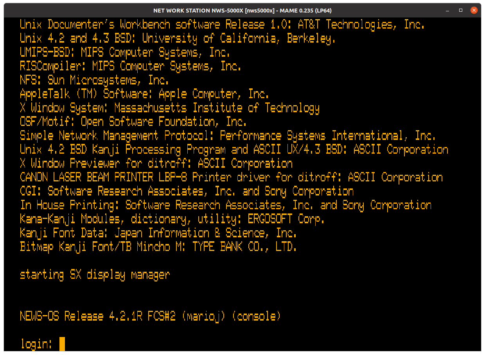
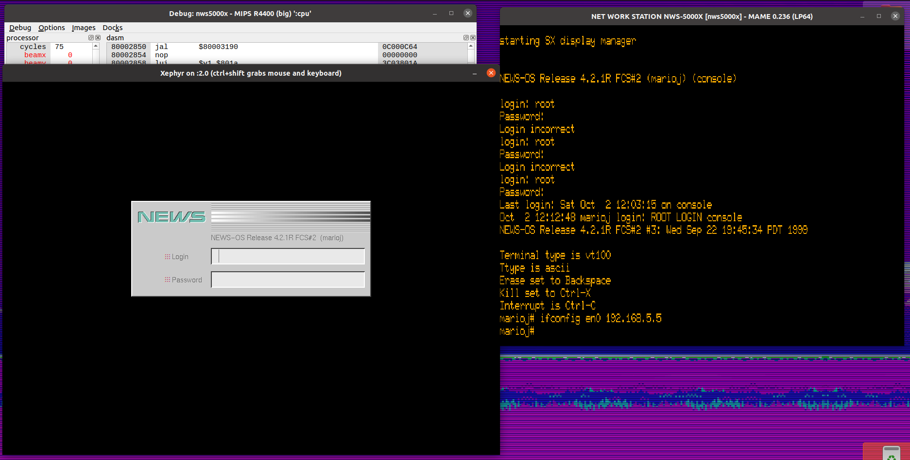
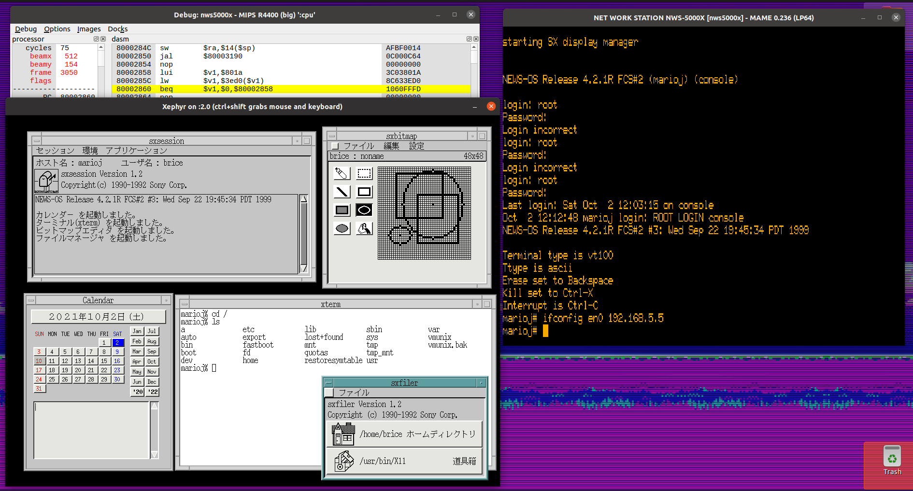
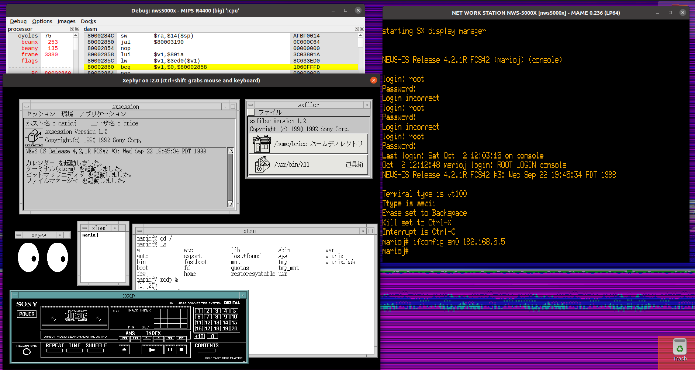
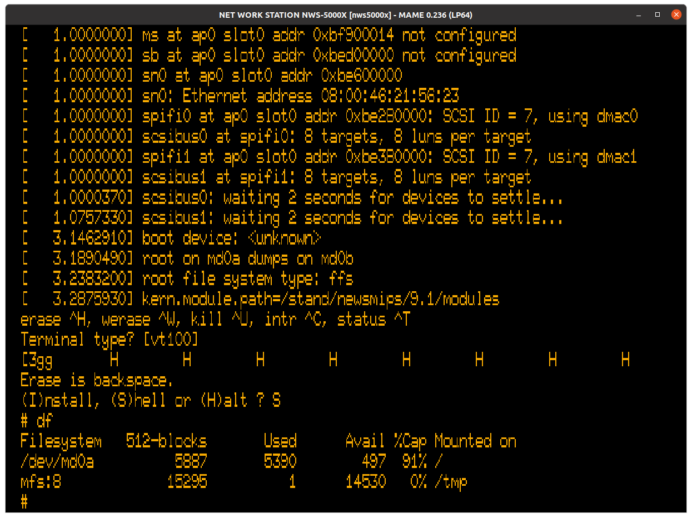

# MAME emulation notes

## Installing NEWS-OS 4.2.1aRD

### Requirements

- MAME build with NWS-5000X driver (0.247 and later)
- NEWS-OS 4.2.1aRD install CD/ISO (you can use `dd` to create an ISO from the CD-ROM)
- NWS-5000X firmware (see `src/rom_extractor.py` for an example of getting ROM images from your own NWS-5000X).

### Booting to the APmonitor (NEWS ROM monitor)

- Put firmware images in `roms/nws5000x`
- Make an empty hard disk image. The NEWS-OS installer is picky about sizes, so you can use the `chdman` command below to get a ~2GB image. Feel free to experiment, though :)
- Launch MAME with the following command line. I recommend using `pty` for serial over `terminal` because Linux 
terminals support the special characters that the installer uses. It is messy and hard to use on the MAME terminal 
emulator. You can use the regular terminal emulator after the installation is complete.
- If you want to use X Windows, be sure to use taputil to set up your network TAP/TUN device before launching MAME. For
now, the NWS-5000X driver does not have any framebuffer emulation, so you must connect over the network to use the GUI.
After starting MAME, make sure to select `TAP/TUN device` in the `Network Devices` menu.

```sh
cd /path/to/mame/repo
sudo src/osd/sdl/taputil.sh -c $USER 192.168.5.5 192.168.5.99 # only if planning on using networking
chdman createhd -o test.chd -s 2088960000
./mame nws5000x -cdrom <path-to-iso> -harddisk test.chd -serial0 pty
```

- Assuming you include `-serial0 pty`, bring up the UI (Scroll Lock to enable the UI, then press Tab) and navigate to `Pseudo Terminals` to locate the pty for this instance of MAME.
- Execute `screen <devspec>` (for example, `screen /dev/pts/5`), then press enter. You can also use your favorite `screen`-like command, of course.
- If all goes well, you should see the APmonitor prompt (`>`)

### Booting to the install kit

- Boot from the CD-ROM drive by running `bo scsi(,60)`
- The default root disklabel (`m`) is fine to use.
- This should boot into the NEWS-OS installer. Follow the prompts and select your desired packages. You might need to adjust the partition size to fit everything.
- I'd recommend not selecting the option to start X automatically. You can enable that later (see `news-os-42.md`), and you'll want the option of a serial login to debug network issues.
- After a long time, the installer will hopefully succeed and halt, bringing you back to the APmonitor prompt. 
- From here, hard reset MAME (with the UI enabled, Shift+F3). This works around a reset issue with the APbus FIFO DMA controller used by the ESCC.

### Booting NEWS-OS 4.2.1aRD for the first time

- Boot from the hard disk by running `bo` or `bo scsi(0,0)`
- If all goes well, this will boot to the login prompt. This will take a very long time due to the disk check.
See `news-os-42.md` for instructions on bypassing the disk check for future boots.
- You should be able to log in (`root`, no password by default) and use the emulated platform!
- Setting up networking can be a bit tricky. Make sure that you have selected "TAP/TUN device" in the MAME UI (Press
Scroll Lock to disable special key passthrough, then press Tab, then scroll down to `Network Devices`).
Then, you should be able to reach the emulator at the configured IP address, as long as you used TAP.
Make sure you add your host as the default route, otherwise XDMCP (and some other applications)
may not work: `route add default <TAP/TUN host IP> 1`
- If you wish to use the GUI (NEWS Desk on Motif/`mwm`), run the command `sxdm` as root.
Then, you can log in over the network assuming you set the default route as listed above.
You can use Xephyr or Xnest to do so (8-bit color mode with Xephyr recommended).
See [xdmcp.py](https://github.com/briceonk/news-os/blob/master/src/xdmcp.py) for a wrapper script
(or to get the command details for Xephyr)

## Current status

### Monitor ROM

With a few workarounds related to memory and APbus initialization, the driver can boot the monitor ROM. Basic commands (memory viewing, status information, expression evaluation, etc.) are mostly functional.


### NEWS-OS 4.2.1aRD

NEWS-OS 4 can successfully install and boot. SXDM, the NEWS X11 session manager, works in MAME. Using a TAP/TUN virtual NIC to connect to the emulated platform, you can use an application like Xephyr to connect to and use the emulator.









### NetBSD

The floppy "miniroot" used to install the newsmips NetBSD port can boot without any workarounds beyond what is required for the monitor ROM. For now, I've only implemented enough of the APbus FIFOQ chip logic to read from devices like the FDC, but that is all the NetBSD installer needs.



With the current SPIFI3 and DMAC3 emulation, it can also detect and enumerate emulated hard drives. However, something still seems to be buggy in the SPIFI3 emulation, since NetBSD seems to think there are multiple LUNs attached, when there is just one. NEWS-OS doesn't have this problem.

### NEWS-OS 6.1.2

For now, I am focusing on 4.2.1aRD but will move on to 6.1.2 (and NetBSD from a hard drive, for that matter) after that.

## Other Issues

### Physical memory mapping and general physical address issues

- It took me a very long time to find a configuration that allowed the monitor ROM to enumerate 64MB of RAM (matches what my platform has). Using a disassembler, I was able to partially reverse engineer the algorithm it uses to scan memory and I came up with a hack that hooks off of a change in a part of memory to shift the memory addresses around to stop the monitor ROM from getting lost in the weeds. This change might be a coincidence, but it happens in between the first scan (where it expects the memory to be split) and the second scan (where it expects the unified 64MB starting from 0x0), and touches regions of the address space that seem to be the memory controller (or similar platform hardware).
- Note that the MIPS R4400SC has a 36-bit physical address bus. I'm not sure if this is breaking things either. I haven't found a way to have an offset greater 32 bits in MAME yet, but that might help. The MSB of the physical address (bit 33) seems to be influenced by the memory region used to access it. See the below section for more details. The memory base from the status command `ss -m` (see above screenshot) has the RAM base set to 0x100000000.

### APbus emulation

- For now, I've done the minimum for the monitor ROM to boot, but there is a lot that will need to be figured out on the fly as more devices are emulated. Miraculously, the APbus specs are available on the [OCMP website](https://web.archive.org/web/19970713173157/http%3A%2F%2Fwww1.sony.co.jp%2FOCMP%2F), courtesy of the Internet Archive.

## Using a modified ROM image in MAME

The monitor ROM does a basic checksum of itself before booting. You can patch this out by changing the code at offset 0x70C to:

```assembly
bne $0, $0, $bfc009c4  ; 0x140000AD in hex
```

The monitor ROM will still run the checksum, but when it fails it will not branch to the boot halt address (0xbfc009c4, which just branches to itself).
